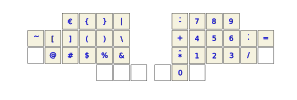

# The OPY-Layout

`OPY` is a keyboard layout in the tradition of [NEO2](https://www.neo-layout.org/Layouts/), [AdNW](http://www.adnw.de/)
and [KOY](https://www.maximilian-schillinger.de/keyboard-layouts-neo-adnw-koy.html) for a split ortholinear keyboard
with shift and space on thumb keys, optimized for mixed English and German usage and paying careful attention to
same-finger bigrams, to their frequencies and locations. The name `OPY` derives from the top left row: 'ZOPY'.

If you dislike same-finger bigrams on your weak fingers, then `OPY` may be worth considering. `OPY` is strongly inspired
by the criteria that shaped [KOY](https://www.maximilian-schillinger.de/keyboard-layouts-neo-adnw-koy.html), but
transferred from the standard row-staggered ISO layout to an ortholinear one with one 16-key purely alphabetical block
under each hand and a 3-key thumb cluster for each thumb. `OPY` is a direct competitor to
[BuT](http://www.adnw.de/index.php?n=Main.OptimierungF%C3%BCrDieGeradeTastaturMitDaumen-Shift).

The OPY-layout de-emphasizes the corners, emphasizes the home positions of all fingers, encourages hand change, and pays
a lot of attention to same finger bigrams, how often and where they occur. The above diagram shows the base layer of the
keyboard. This is the alphabetic layer that contains the 26 letters `A` to `Z` as well as the German umlaut characters
`Ä`, `Ö`, `Ü` and the `ß`.

The home positions of the index fingers are `I` and `T`; those of the thumbs are shift and space.

For the design of the alphabetical layer by a custom layout optimizer, please take a look at the [Details of the
Alphabetical OPY Layer](alphabetical.md). Compared with that optimization result, the keys `Q` and `ß` were moved from
the top row to the sides of the middle row because my fingers are short, and that position is more convenient.

## Physical Properties

The keyboard is split into two independent halves, one for each hand. In my implementation on the *Yackboard*, they are
connected by Bluetooth Low Energy (BLE) with each other and with the computer. Both halves are run by a *Nice!Nano v2*
micro controller with the [ZMK](https://zmk.dev) operating system.

I follow the philosophy that no finger ought to move further than one position away from its rest position. This limits
the keyboard, apart from the thumbs, to three rows of six columns for each hand. The index and the pinkie fingers may
serve two columns while the middle and ring fingers serve one column each. Since the pinkies are the shortest, there are
no keys in the top row of the two outer columns of each half.

Note that USB or BLE-HID keyboards send raw key codes to the computer, i.e. codes that tell it which key at what
location was pressed, but not yet which letter is assigned to it. The computer then interprets the raw key code
according to a country specific key map. The present ZMK implementation of the OPY layout assumes that the computer is
set up to the "US, international, with dead keys" key map. This allows our key board to easily use special characters
and also to choose whether the diacritics (grave, apostrophe, double quote, caret, tilde) print directly (in this case
the keyboard sends a space after the diacritic) or whether they modify the following character (which is then left to
the computer).

## Logical Properties

### Layer and Hand Structure

As with 2x (3x4 + 2x2 + 3) = 38 keys, there is no space for a number row nor for cursor keys nor for a function key row,
all these are added in separate layers: numbers (blue), navigation (red), function (green), dead keys (yellow) and
configuration of the keyboard (purple). For each of these groups, it makes sense to concentrate the most relevant keys
on the right half of the keyboard so that it is possible to remove the left hand from the keyboard in some situations:

- entry of numbers and basic formulas while retaining basic editing functions

- full navigation and basic editing functions

### Modifiers and Layer Selection

On a regular US ANSI or European ISO keyboard, many of the most frequently pressed keys are located under the pinkie
fingers: escape, tab, shift, control, backspace and enter. It makes sense to move most of these to the thumbs which are
under-utilized by the standard keyboard layouts.

I therefore place escape, shift and tab under the left thumb whereas enter, space and backspace are under the right
thumb. This leaves all relevant editing keys on the right half so that the keyboard may be used single-handedly for
navigation and basic editing.

With this key assignment, the thumbs are already busy enough, and I implement the other modifiers (control, alt and
windows: grey) as well as the layer switching (blue, red, green, yellow and purple) as hold-tap functions on the home
row: if you tap these keys, you get the letters whereas if you hold them, they act as modifiers. In addition to these
home row modifiers, two dedicated layer switching keys are placed on the bottom row under the pinkie fingers. They cycle
through the layers for numbers, navigation, functions and configuration when tapped and revert to the base layer when
held.

Shift is not implemented as a home row modifier, but rather as a dedicated thumb key because it is used so
frequently. Holding the dedicated shift key is the shift modifier. Tapping it once is a one-shot shift (sticky
shift). Tapping it twice is 'caps word', i.e. capitalizes the subsequent word.

Once shift has been placed on a thumb key, I found it inconvenient to control the layers by thumb keys, too, simply
because editing code requires frequent switching between alphabetic, number, symbol and navigation keys, and this would
lead to too many same-thumb bigrams. Hence the decision to implement the layer switches as home row modifiers.

If held longer, tab yields back-tab. Shift backspace gives delete, and shift `ß` gives `§`.

For more details on home row mods, please take a look at precondition's
[guide](https://precondition.github.io/home-row-mods). Another good reference on the use of layers and modifiers is the
[Miryoku Layout](https://github.com/manna-harbour/miryoku/tree/master/docs/reference).

### The Number and Symbols Layer

All keys that have been left empty in the diagram retain their function from the base layer. If held longer, the
asterisk gives a caret, the minus sign an apostrophe, and the decimal point a comma. These are examples of *lingering
keys*. They are implemented by the `hold-tap` behaviour of ZMK which I have configured in such a way that in order to
get key repeat (which is done by the operating system of the computer rather than by the keyboard), I first tap and
then, in rapid succession, press and hold the key. The `hold-tap` behaviour of ZMK is configured to suppress the hold
function in this case and therefore issues a second, long tap. This allows the operating system to trigger the key
repeat function.

The tilde on this layer is non-dead, i.e. it displays immediately.

### The Navigation and Punctuation Layer

The navigation and punctuation layer contains emulations of the three mouse buttons as well as the Emacs commands for
moving to the beginning and to the end of the document on the right half and plenty of punctuation keys on the left
one. All diacritics on this layer (grave, apostrophe, acute, double quote and caret) are non-dead, i.e. display their
character immediately.

### The Function Layer

On the inner columns, the function layer contains the volume and brightness control keys.

### The Dead Key Layer

This layer contains the dead-key versions of the diacritics (grave, apostrophe, double quote, caret and tilde). It can
be reached only by a hold-tap modifier. There are two additional dead keys, the circle and the slash, that are
implemented by adaptive keys with a comfortable delay of one second. The other symbols are not dead, but print
immediately.

### The Configuration Layer

The final layer which can only be reached by four-fold layer cycling, configures the bluetooth setup of ZMK. There are
five keys to select the target among five paired bluetooth devices, there are keys to switch between USB and BLE data
transfer as well as a key to clear the current bluetooth profile.

### Adaptive Keys

When typing quickly, some key assignments change dynamically in order to avoid some same finger bigrams. This technique
was popularized by the [Hands Down](https://sites.google.com/alanreiser.com/handsdown) layouts. The following are the
adaptive keys of the OPY layout.

|after pressing|this key|changes to this key|example|
|----|---|---|---|
|U|Ü|P|upper (for the first `p`)|
|P|Ü|P|upper (for the second `p`)|
|P|N|U|puzzle|
|K|H|I|kiss|
|K|J|U|kurz|
|C|M|L|clash|
|B|G|L|blue|
|N|X|M|inmate|
|Y|U|O|you|

## Lingering Keys

Apart from the lingering keys of the Number Layer, the following lingering keys are convenient. When the keys of
the opening brackets `(`, `[`, `{` and `<` are held a bit longer, their closing counterpart is added automatically and
the cursor placed between the brackets.

When `q` is pressed, the keyboard rather produces `qu`, and depending on whether shift is not held, held briefly or held
the entire time, it produces the variants `qu`, `Qu` or `QU`. Only if the key `q` is held longer, a single `q` or `Q` is
produced.

## Combos and the Most Frequent Words

Up to this point, we have not yet made use of key combinations, i.e. that two keys are pressed simultaneously (within 50
ms). Interestingly, when I type, this is rarely misinterpreted as one of the hold-taps, and so I can use combinations
independently.

Presently, I am trying combos in order to produce the 10 most frequent words in both English and German. When the combo
is pressed, the corresponding word including a subsequent space is issued. If preceded by a one-shot shift, these words
are capitalized. When shift is held all the time, they appear entirely in uppercase letters:

|combination|word|
|---|---|
|TH|the|
|OF|of|
|AN|and|
|TO|to|
|TA|that|
|FR|for|
|WA|was|
|WI|with|
|ON|on|
|NT|not|

as well as for the German words,

|combination|word|
|---|---|
|DE|der|
|DI|die|
|UN|und|
|IN|in|
|DN|den|
|VO|von|
|ZU|zu|
|DA|das|
|MI|mit|
|SI|sich|

## ZMK Implementation

In order to use this layout with [ZMK](https://zmk.dev), you need to select the *English (US, international, with
dead keys)* keyboard layout on your computer.

Note that as of October 2024, the official release of ZMK needs to be extended by the following patches for the present
layout to function:

- the custom retro-tap patch (required for the lingering `q` on a key that also has a `hold-tap` function and for the
  layer-reset function when holding the `Shift` key without tapping anything);

- the antecedent morph (aka adaptive keys) patch for the adaptive keys.

For the configuration of ZMK's `hold-tap` function, I largely followed urob's [Timeless Home Row Mods](https://github.com/urob/zmk-config).

This is all done in the `devel-yackboard` branch of my [inofficial fork](https://github.com/voidyourwarranty2/zmk/tree/devel-yackboard) of ZMK.
