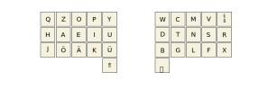

# The Alphabetical OPY-Layer

`OPY` is a layout for a split ortholinear keyboard with shift and space on thumb keys and punctuation on a separate
layer, optimized for English and German texts. This overview focuses on the alphabetic layout. For the other layers,
please see the [README](README.md). The name `OPY` derives from the top left row `QZOPY`.

`OPY` builds on the results of [NEO2](https://www.neo-layout.org/Layouts/), [AdNW](http://www.adnw.de/) and
[KOY](https://www.maximilian-schillinger.de/keyboard-layouts-neo-adnw-koy.html) and adapts them from the standard
row-staggered ISO layout to an ortholinear one with one purely alphabetical block under each hand, punctuation on a
separate layer, and shift and space on the thumb keys. The layout de-emphasizes the corners, emphasizes the home
positions of all fingers, encourages hand change, and pays a lot of attention to same finger bigrams, how often and
where they occur. If you dislike same-finger bigrams on your weak fingers, then `OPY` may be worth considering. `OPY` is a
direct competitor to [BuT](http://www.adnw.de/index.php?n=Main.OptimierungF%C3%BCrDieGeradeTastaturMitDaumen-Shift).

## The Optimizer

`OPY` was found by a custom layout optimizer that was tasked to arrange the 26 letters plus 4 German Umlaut and ‘ß’
characters on two 3×5 grids.

### The Text Corpus

I have about 2 MB of text each of English fiction and non-fiction as well as German fiction and non-fiction from
[Project Gutenberg](https://www.gutenberg.org/). From experience, I guess that as soon as you have at least 500 kB of
text in each of the four categories, the bigram and trigram frequencies no longer change sufficiently in order to affect
the optimizer.

From these four groups of text, I have extracted the relative frequencies of letters, bigrams and trigrams. In the
subsequent analysis, the four categories of text are weighted equally (irrespective of the actual length of the
texts). Since I have decided to move all punctuation to a separate layer, the analysis focuses on the alphabetic keys
only. I therefore pre-process the texts as follows:

- all contiguous white space is compressed to a single [Space] key,

- all capital letters are replaced by a sequence of first [Shift] and then the letter key,

- all special characters, punctuation and digits are removed from the text.

### Optimization Criteria

The optimization criteria are as follows.

1. There is a cost of 1.0 for each key stroke that is not a home position.

2. There is an additional cost per key stroke that refines the above, depending on how difficult I find it to reach any
   specific position. For the left hand, the matrix of costs is as follows. For the right hand, the mirror image is
   used.

|pinkie|ring|middle|index|index|
|---|---|---|---|---|
|1.0|0.5|0.2|0.2|0.3|
|0.2|0.1|0.0|0.0|0.2|
|0.7|0.5|0.3|0.3|0.4|

3. There is a constant cost of 1.0 for every bigram that is confined to a single of the 5×3 blocks. Thus, I reward
   switching hands or switching over to one of the thumbs.

4. There is a constant cost of 1.0 for every bigram that involves twice the same finger ('same-finger-bigram' SFB).

5. There is an additional cost for every bigram that refines the above as follows. For SFBs,

- a cost of 0.1 for a key repetition,

- a cost of 0.3 for moving down a row with the same finger,

- a cost of 0.6 for moving up a row,

- a cost of 2.0 for moving up or down by two rows,

- an additional cost of 1.0 for moving an index finger to a different column.

For distinct fingers of the same hand,

- a cost of 0.1 for a horizontal movement,

- a cost of 0.2 for moving down a row,

- a cost of 0.4 for moving up a row,

- a cost of 1.5 for moving up or down by two rows.

For all bigrams that are confined to a single hand (3×5 block), a cost of imbalance for each stroke of the bigram; for
the left hand as follows and for the right hand the mirror image. These numbers penalize any motion of the hands out of
their home position, but only if this is relevant to the flow of typing, i.e. when not preceded or followed by a change
of hands or a changeover to one of the thumbs (The bigrams suppressed by this term are sometimes called ‘lateral stretch
bigrams’ or LSBs).

|pinkie|ring|middle|index|index|
|---|---|---|---|---|
|0.3|0.1|0.0|0.0|0.3|
|0.0|0.0|0.0|0.0|0.2|
|0.3|0.1|0.0|0.0|0.3|

The Euclidean norm of the above five cost functions is the objective function of the minimizer.

### Optimization Non-Criteria

I do not explicitly add criteria that enforce a balancing of hands or a balancing of fingers. If I did, this would
encourage the optimizer to compromise on bigram properties just in order to improve balance, but it is poor bigram
properties that obstruct the flow of typing way more than any small imbalance ever could.

I also do not explicitly add any criteria on indirect bigrams inside trigrams ('disjoint SFBs' or DSFBs) or any more
complicated measurements, simply because the above criteria already fully determine the layout (up to minor permutations
of the six most infrequently used keys 'Q', 'X', 'Z', 'V', 'J' and 'ß'). Again, it is my impression that adding any
further terms to the cost function tends to compromise the results achieved so far.

Neither do I explicitly consider bigrams involving the columns of the weak fingers which was done in the development of
[KOY](https://www.maximilian-schillinger.de/keyboard-layouts-neo-adnw-koy.html). In item (5.) of the cost functions, the
last term that suppresses LSBs has a similar effect though. It turns out that the optimizer finds a very good result as
is detailed in the optimization report below.

I finally do not explicitly consider 'rolling' at all. It seems that the placement of the most frequent letters on the
home row already produces a high number of inward rolls as a by-product. In fact, `OPY` scores very high in terms of
inward rolls in Dario Götz' layout analyzer (see below).

## Optimization Report

Any objective function on the universe of keyboard layouts has got plenty of local minima that are difficult to leave. I
had the best results with randomized key permutations (transpositions, 3-cycles and double transpositions), but the
results still retain a considerable dependence on the initial values. Therefore, the optimizer was run again and again
and the results inspected manually in order to separate interesting from poor candidates. I found that it is way more
helpful to inspect actual key sequences and their frequencies rather than over-thinking the objective function and
adding too many competing terms to it.

Running this optimizer starting with any layout inspired by the `NEO` family tends to concentrate the vowels on the home
row of one hand and the most frequent consonants on the home row of the other. This separation is very consistent as
long as only German is considered. As soon as a sufficient amount on English is added, however, the letter 'H' begins to
act as a vowel, and it becomes as frequent or more as 'O' and 'U'. This classification of 'H' as a vowel happens because
of frequency and also because the typical bigrams involving 'H' and an important consonant are similar to the bigrams
involving an actual vowel and the consonant. If 'H' is treated like a vowel, one of the actual vowels needs to leave the
home row though.

Depending on the ratio of English to German, either 'U' is more frequent than 'O' (if German dominates) or vice versa
(if English dominates). With my 50%/50% mixture of English and German, 'O' is already more frequent. Interestingly, it
is then 'O' that needs to leave the home row, and it is moved to the same column as 'E' (where it is still under a
strong finger, but can hardly cause any SFBs). The less frequent 'U' ends up at the inner position of the left index
finger.

This is plausible: since each index finger serves six keys, there is a much higher likelihood of SFBs, and so it is the
less frequent keys that are moved to the inner columns of the index fingers. This also explains one of the main
differences compared with the `NEO2` layout: With `NEO2`, the most frequent vowel 'E' and the most frequent consonant
'N' (with a German only text corpus) are placed under the home position of the index fingers – presumably because these
are the fastest and strongest fingers. This causes unnecessary SFBs though because of the higher number of keys served
by the index fingers. Indeed, this is one of my main criticisms of `NEO2`, especially with English.

My optimizer places the most frequent vowel 'E' at the home position of the middle finger. The index finger gets the
less frequent 'I', reducing the number of SFBs. Among the consonants, in English texts, 'T' is the most frequent whereas
in German, this is is 'N'. With my 50%/50% mixture it is again 'N'. Thus, similarly to the vowels, 'N' is placed at the
home position of the middle finger while the slightly less frequent 'T' is moved to the index finger. The remainder of
the home row is then determined by the home position condition and by positional cost only, simply because of the huge
difference in frequencies between the important and the unimportant letters.

The bigram dependent parts of the objective function then almost fully arrange the other keys in the rows above and
below. Merely the six letters 'Q', 'X', 'Z', 'V', 'J' and 'ß' are used so infrequently that they can still be permuted
with little consequences.

In contrast to some optimizers, I do not encourage a particular ratio of finger usages because I often found that this
leads to poorer results. Presumably this happens because the relative frequencies of the letters are rather precisely
determined by the text corpus used, and so this would introduce a strong bias on which letters to associate with which
finger, but one that is not determined by bigram properties.

The resulting layout

- Works well with both English and German.

- Massively favours the home positions and further the home row: 52.3% of all key strokes are home position strokes on
  the 3×5 blocks; an additional 18.5% of key strokes are thumbs in their home position.

- Strongly favours the use of alternating hands: only 19.5% of all bigrams do not involve a change of hands (i.e. do not
  leave their 3×5 block either for a thumb or for the other block).

- Panically avoids SFBs: only 2.88% of all bigrams involve a single finger (this number still includes all key
  repetitions as in 'stuff')

- The unavoidable SFBs concentrate on the strong fingers. Indeed, the 20 most frequent ordered SFBs (excluding
  repetitions) are the following. No ring or pinkie finger SFB is among them, only one two-row jump with 'LM' on a
  middle finger, and the only SFB that is more frequent than 0.1% is CT, a one-row down move of the right index finger
  towards its home position.

|bigram|frequency|finger|
|---|---|---|
|CT|0.118%|index |
|GT|0.073%|index |
|UP|0.073%|index |
|TW|0.066%|index |
|PI|0.062%|index |
|NL|0.055%|middle|
|IK|0.047%|index |
|KI|0.043%|index |
|IP|0.039%|index |
|UI|0.036%|index |
|PU|0.033%|index |
|EO|0.031%|middle|
|BT|0.026%|index |
|NM|0.021%|middle|
|KU|0.020%|index |
|OE|0.015%|middle|
|LM|0.015%|middle|
|LN|0.014%|middle|
|DT|0.014%|index |
|TC|0.013%|index |

- The frequency of bigrams that involve two neighbouring weak fingers is as follows. The following frequencies exclude
  all bigrams in which both strokes are in home position. On the home row, anything is allowed.

|neighbour pair|frequency|
|---|---|
|ring, pinkie	|0.25%|
|middle, pinkie	|0.59%|
|middle, ring	|0.60%|

The five most frequent bigrams in each of these groups are the following.

|neighbour pair|bigram|frequency|
|---|---|---|
|ring, pinkie	|FR|0.11%|
|ring, pinkie	|RF|0.05%|
|ring, pinkie	|JA|0.02%|
|ring, pinkie	|HÖ|0.02%|
|ring, pinkie	|RV|0.02%|
|middle, pinkie	|HO|0.20%|
|middle, pinkie	|RM|0.09%|
|middle, pinkie	|JE|0.07%|
|middle, pinkie	|RL|0.07%|
|middle, pinkie	|OH|0.05%|
|middle, ring	|LS|0.15%|
|middle, ring	|ZE|0.12%|
|middle, ring	|NF|0.06%|
|middle, ring	|FL|0.05%|
|middle, ring	|MS|0.04%|

- The 3×5 blocks of the hands are slightly imbalanced (48% left hand, 52% right hand).

- The home positions of the ring and pinkie fingers are fully utilized. This requires a good coordination and may need some practice.

- The combination of home position focus, hand change, and low number of SFBs allows for rather smooth typing over long
  periods of time. The price to pay, however, is a very few 'ugly' words, for example, everything involving 'you',
  including 'layout' – a horrible SHT (same-hand trigram). Already the NEO2 layout suffers from occasionally required
  acrobatics around the left index finger, but these occasions have become much more infrequent. Never try to type the
  word 'puke' on OPY though!

  In order to quantify 'ugly', the following are all same-hand trigrams that involve three off-home key strokes and that
  have a frequency of at least 0.01%.

|trigram|frequency|subjective characterization|
|---|---|---|
|YOU|0.048%|ugly|
|OOK|0.024%|unpleasant|
|UPO|0.019%|acceptable|
|PPO|0.011%|acceptable|
|UPP|0.010%|acceptable|

Note that several of the SFB's listad here no longer play a role once adaptive keys are used and the letter on the
second key, if keys are pressed in rapid succession, can depend on the previous key.

## Comparison

When comparing `OPY` to other layouts, keep in mind that it was developed for [Shift] and [Space] on the thumbs, and for
punctuation on a separate layer. All the statistics above were obtained after an appropriate transformation that isolates
the alphabetic part (please refer to the section The Text Corpus above for the details).

### AdNW, KOY and BuT

The AdNW community has published an ortholinear layout [BuT](http://www.adnw.de/index.php?n=Main.OptimierungF%C3%BCrDieGeradeTastaturMitDaumen-Shift)
for a slightly larger board that I can compare my figures to. For the comparison, I move the 'X' and 'ß' of `BuT` from the sixth column (outer pinkie
column) to the punctuation keys. This ought to result in directly comparable frequency statistics.

Compared with `BuT`, in `OPY`

- The percentage of home position strokes is identical.

- The percentage of bigrams on the same 3×5 block (lack of hand change) decreases from 20.3% to 19.5% (improvement).

- The percentage of SFBs increases from 2.60% to 2.88% (deterioration).

- Whereas `BuT` has 4 of its 20 most frequent SFBs on ring fingers and additional 3 of the 20 on pinkie fingers, OPY has none of the 20 most frequent
  SFBs on ring or pinkie fingers (improvement).

- The percentage of bigrams that involve two neighbouring strokes of the weak fingers not both of which are in home position, changes from 0.74%,
  1.65% and 0.59% to 0.25%, 0.59% and 0.60%, respectively, for the pairs of ring-pinkie, middle-pinkie and middle-ring. Two of these frequencies
  decrease considerably (improvement).

### Dario Götz’ Optimizer

`OPY` is listed in the Corne and Moonlander category of Dario Götz’ [Keyboard Layout Optimizer](https://keyboard-layout-optimizer.fly.dev/) which
allows for the automatic comparison of several competing layouts. In these categories (in which shift is on a thumb key) it scores very high. In
particular, the score for inward rolls is surprisingly high. In the Ortho category with shift on the pinkie fingers, it suffers from SFBs that
appear because the pinkie home position is occupied by 'H' and 'R', two rather frequent letters, and receives an average score.

### Performance in English Only

In a recent discussion on [Reddit](https://www.reddit.com/r/KeyboardLayouts/comments/1083rgu/comment/j4fs36p/), I posted a comparison of `OPY`
with the [Hands Down Reference](https://sites.google.com/alanreiser.com/handsdown/home/hands-down-reference) layout for a purely English text corpus
(here Hands Down Reference wins – is was optimized for English after all). In a reply to that Reddit post, you can also find my analysis for
Hands Down Reference with a German text corpus, a comparison that OPY wins by a wider margin.

## References

The following is an incomplete list of resources I took a look at when I developed OPY.

### Layouts for English

- [Dvorak](https://en.wikipedia.org/wiki/Dvorak_keyboard_layout)

- [Colemak](https://colemak.com/)

- [Workmen](https://workmanlayout.org/)

- [Canary](https://github.com/Apsu/Canary)

- [Hands Down](https://sites.google.com/alanreiser.com/handsdown), a family of layouts including *Hands Down Reference*, *Hands Down Alt*
  and *Hands Down Neu*; there are also layouts with a letter on a thumb key

- [RSTHD](https://xsznix.wordpress.com/2016/05/16/introducing-the-rsthd-layout/) with a letter on a thumb key

- [T34](https://www.jonashietala.se/blog/2021/06/03/the-t-34-keyboard-layout/) with a letter on a thumb key, emphasis also on Swedish and on vim.

- [The Symmetric Typing Project](https://kennetchaz.github.io/symmetric-typing/), *Soul* and *Niro*

- [The Carpalx Project](http://mkweb.bcgsc.ca/carpalx/?full_optimization)

- [UCIEA](https://keyboard-design.com/letterlayout.html?layout=uciea-vanilla.en.ansi)

- [Assit](https://millikeys.sourceforge.net/asset/)

- [MTGAP](https://github.com/kenranunderscore/mtgap-layout)

- [Capewell](http://www.michaelcapewell.com/projects/keyboard/)

- [Arensito](http://www.pvv.org/~hakonhal/main.cgi/keyboard)

- [Keyboard Design](https://keyboard-design.com/index.html) with its [Best Layouts](https://keyboard-design.com/best-layouts.html) section

- [Layout Playground](https://o-x-e-y.github.io/layouts/playground/index.html)

### Layouts for German and for German and English

- [Neo Family](https://neo-layout.org/Layouts/) including `NEO2`, `BONE` and `MINE`

- [AdNW Family](http://www.adnw.de/) including [KOY](http://www.adnw.de/index.php?n=Main.SeitlicheNachbaranschl%c3%a4ge),
  [BuT and PUQ](http://www.adnw.de/index.php?n=Main.OptimierungF%c3%bcrDieGeradeTastaturMitDaumen-Shift)

- [KOY](https://maximilian-schillinger.de/keyboard-layouts-neo-adnw-koy.html)

- [VOU](https://maximilian-schillinger.de/vou-layout.html)

- Dario Götz' [Keyboard Layout Evaluator](https://dariogoetz.github.io/keyboard_layout_optimizer/) and the associated
  [ranking tables](https://keyboard-layout-optimizer.fly.dev/)

- [CRY](https://hg.sr.ht/~arnebab/evolve-keyboard-layout#cry), obtained from Arne Babenhauserheide’s optimizer

- [Malt](http://www.adnw.de/index.php?n=Main.Malt), a split layout from the 1970s (!) with a letter on a thumb

- [Malt++](http://www.adnw.de/index.php?n=Main.FehlerfreihheitUndDaumentasten), where the AdNW community took Malt

- [German Dvorak Type 1](http://www.adnw.de/index.php?n=Main.DeutscheDvorakTyp1)

- [German Dvorak Type 2](http://www.adnw.de/index.php?n=Main.DeutscheDvorakTyp2)

- [German Colemak](http://www.adnw.de/index.php?n=Main.ColemakDeutsch)

- [Ristome](http://www.adnw.de/index.php?n=Main.RISTOME), a Jugend Forscht project

- [De-Ergo](http://www.adnw.de/index.php?n=Main.DeErgo), layouts from the 1960s

- [Nordtast](http://www.adnw.de/index.php?n=Main.Nordtast)

### Further References

- [Keyboard Layout Doc](https://docs.google.com/document/d/1_a5Nzbkwyk1o0bvTctZrtgsee9jSP-6I0q3A0_9Mzm0/edit)

- [Reddit Introduction to /r/KeyboardLayouts](https://www.reddit.com/r/KeyboardLayouts/comments/fedsnb/introduction_to_rkeyboardlayouts_and_why_this_sub/)
